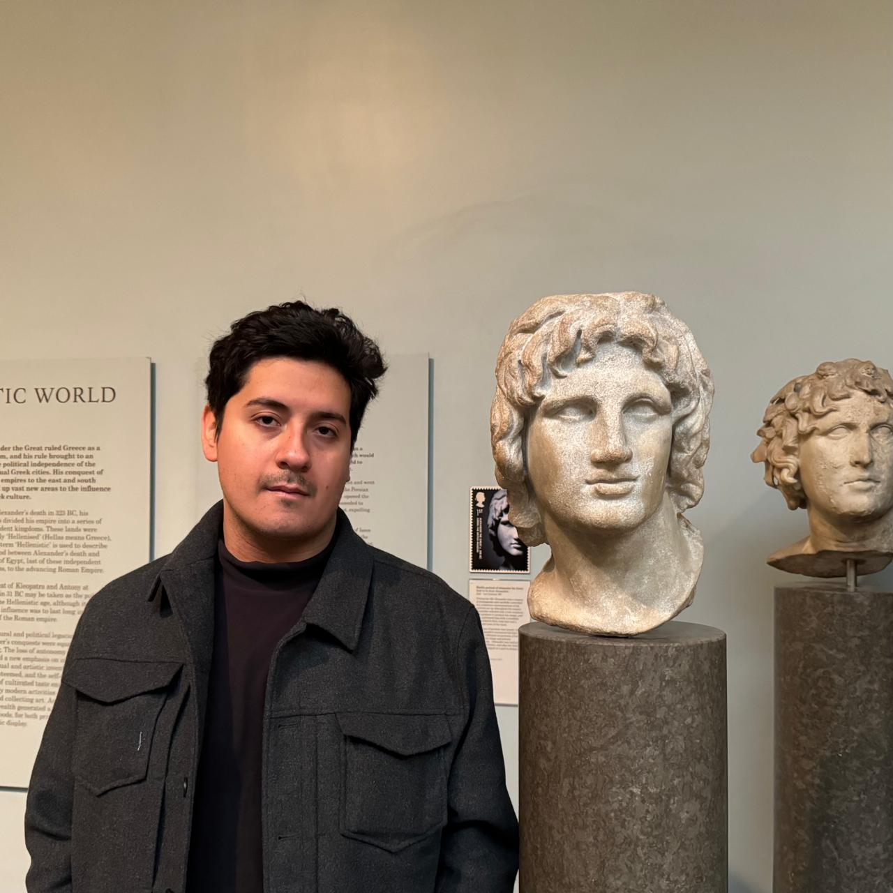

# Diego Barros Araya
{: style="text-align: center;"}

**Senior IT Engineer & Technical Consultant**
{: style="text-align: center;"}

Let's connect to discuss IT infrastructure, technical innovation, or solving complex challenges with technology.
{: style="text-align: center;"}

    

## About Me
{: style="text-align: center;"}

With a strong foundation in computer science and over a decade of experience as a Linux user, I focus on implementing scalable, automated solutions in cloud-native environments (Docker, OCI) and embedded systems. My expertise also includes Atlassian products, and I have a proven track record of executing technical projects and collaborating with global technology teams to deliver efficient, high-performance IT solutions.

As a Senior Engineer, I bring a track record of leading technical teams, driving project execution, and managing stakeholders in high-impact environments. My consulting experience has allowed me to collaborate with global technology leaders, helping them streamline workflows, enhance productivity, and achieve strategic IT goals.

Beyond my professional work, I'm an avid explorer of both legacy Unix systems and cutting-edge Linux distributions, driven by a passion for open-source technology and continuous learning.

Let's connect to discuss IT infrastructure, technical innovation, or solving complex challenges with technology.
{: style="text-align: center;"}